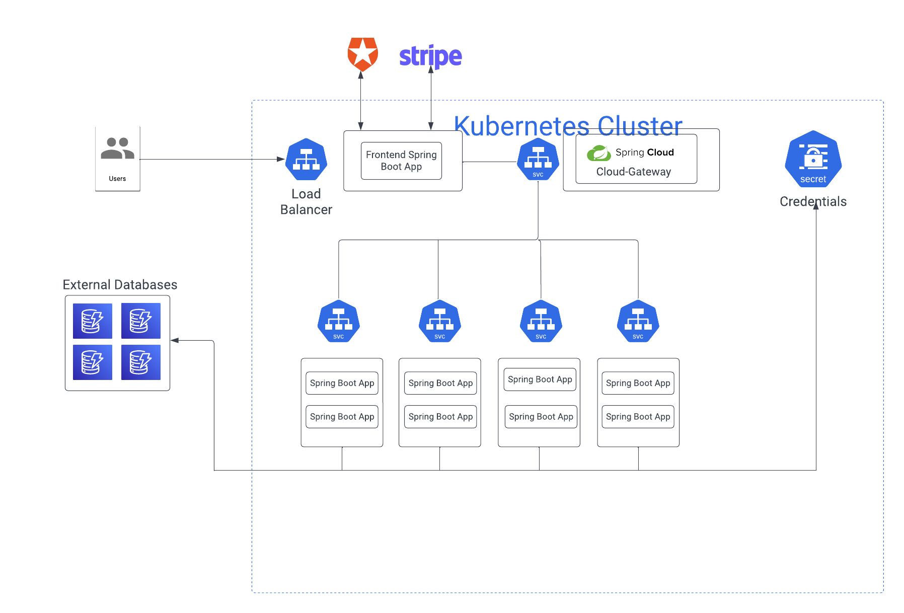
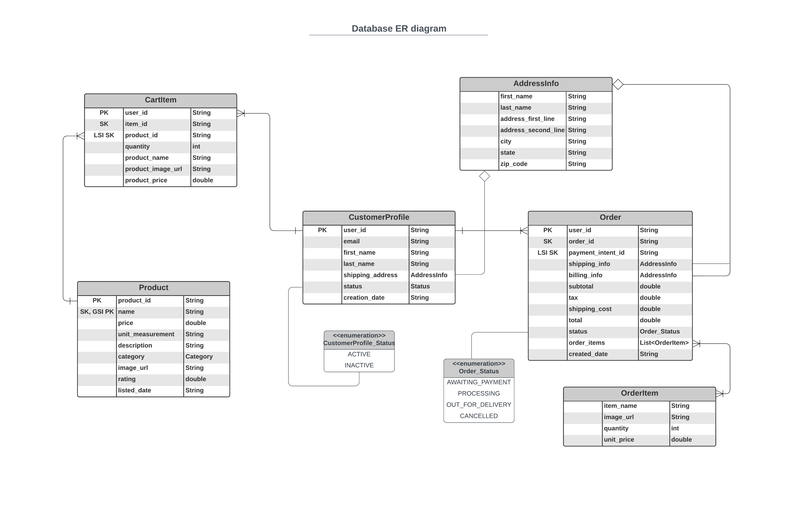

# Grocery-E-commerce
Grocery E-commerce website built using Spring and made deployable to a Kubernetes cluster

## Technologies used:
- Spring Boot
- Spring Cloud
- Stripe API
- Auth0
- AWS DynamoDB
- Guava caching
- Zipkin
- Docker
- Kubernetes
- JUnit

## Features:
- [x] Login/Logout with ability to save info to profile
- [x] View all products at a glance or view products by category
- [x] View extended product info page
- [x] Add/Remove products to/from cart with auto-increment quantity for items already existing in the cart
- [x] Place and view orders with full checkout experience and payment handling by Stripe
- [x] Fuzzy search for products
## In progress:
- [ ] Enabling distributed caching for individual services via Redis using the Jedis library
- [ ] Multiple saved addresses for shipping and billing
- [ ] Creation of another project that uses existing Order Service API to create an order fulfillment service that updates status and contents of user orders
- [ ] Refactor of applications to utilize eureka discovery service in dev and prod kubernetes cluster instead of kubernetes native service discovery

# Current Development Demo

https://user-images.githubusercontent.com/100180211/212825299-7a764277-3464-4f33-996d-0239cbd9c704.mov

## Design

